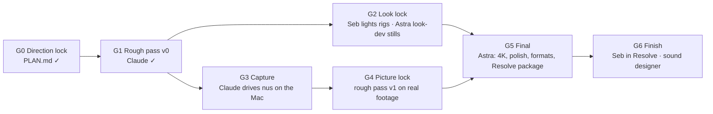

# The roundtable

Four seats, one film. This folder is how work passes between them without
drifting. **`PLAN.md` is the single source of truth**. Everything here
points back to it, and a change to the film is a change to `PLAN.md`
first.

| Seat | Role | Owns | Never |
|---|---|---|---|
| **Seb** | Director | Taste; the approval at every gate; lighting by hand (Light Wrangler, Photographer); the finish in Resolve; the score (the Live set) | — |
| **GPT Pro** | Prompt editor | Turning a brief in this folder into the sharpest prompt for an agent; critiquing prompts against `CONTEXT.md` | Invents features, claims, beats or file paths; its prompts run only after Claude checks them against the repo |
| **Claude Code** | Scaffolding, direction, rough pass | The repo and pipeline; the rough cut (`Cut`); the Mac reshoot (it drives nus); the acceptance checks; verifying every prompt before it runs | Final look decisions (proposes; Seb decides) |
| **Astra** | Final execution and look | The 4K renders; polishing light, camera and compositing within the locks; the three formats; the Resolve package | Changes copy, beats, claims or the score; overwrites Seb's rig files; publishes Apple assets |

## The flow

| Gate | Who does it | What comes out | Seb approves |
|---|---|---|---|
| **G0 Direction** ✓ | Claude + Seb | `PLAN.md`: copy, beat table, type, Memphis kit, 3D shot plan | the plan |
| **G1 Rough pass v0** ✓ | Claude | `out/rough/nus-rough-v0.mp4` (the `Cut` composition, mocks and stage-1 plates) | timing, copy, order of ideas |
| **G2 Look lock** | Seb (rigs) + Astra (look-dev) | `blender/rigs/<shot>.blend` lit by hand; Astra's hero still per shot on those rigs; the `LOOK` values frozen | one still per shot |
| **G3 Capture** | Claude (via `RESHOOT.md`), with a prompt GPT Pro tightens | `public/footage/`: ten recordings, marks, manifest, latency | each take |
| **G4 Picture lock** | Claude | rough pass v1: `Cut` on real footage, MOCKs gone, 2.8 ms (or the new number) settled | **timing and copy freeze here** |
| **G5 Final** | Astra (`ASTRA.md`), with a prompt GPT Pro tightens | 4K masters in three formats plus the Resolve package (`RESOLVE.md`); `npm run check` clean | the masters |
| **G6 Finish** | Seb + the sound designer | graded masters with the final mix | — |

G2 and G3 run side by side. G5 waits for both.

## Rules of engagement

1. **One source of truth.** `PLAN.md` decides. `CONTEXT.md` is its
   condensed form for seats that can't read the repo; Claude regenerates
   it when the plan changes (the date is at its top).
2. **Prompts are checked before they run.** GPT Pro drafts. Claude checks
   every file path, command, verb, beat and claim against the repo, and
   returns a marked-up diff if anything is off. Seb approves.
3. **Locks are locks.**
   - Copy, claims and the beat table freeze at G4.
   - The score never changes here: the Live set is Seb's, and
     `ableton/bounce.wav` is its export.
   - The look is open until G2, then it's Astra's to finish within the
     locked `LOOK` values and rigs, and to propose beyond them.
4. **Seb's files are Seb's.**
   - Rig workfiles (`blender/rigs/`) are never overwritten; the script
     refuses without `--force 1`.
   - Proposals go beside them, as `blender/rigs/<shot>.astra-<n>.blend`.
   - The master `.als` is never written.
5. **Nothing licensed leaves the machine.** The repo is public. Nothing
   Apple (`assets/models/`), no renders, footage, rigs, HDRIs or the
   bounce. `npm run check` fails on any of them.
6. **Every claim is true of the footage beside it.** If a shot can't show
   what its line says, the line changes (at a gate), not the shot.

## Files here

| File | For | Is |
|---|---|---|
| `CONTEXT.md` | GPT Pro, Astra | the film in one page: pillars, claims, beats, type, locks, the repo |
| `GPT-PRO.md` | GPT Pro | what to write, for whom, in what shape, and what it must never do |
| `ASTRA.md` | Astra | the final-execution brief: environment, locks, procedure, acceptance, deliverables |
| `RESOLVE.md` | Seb, Astra | exactly what Resolve receives, and how it's laid out |
| `../RESHOOT.md` | Claude on the Mac | the capture standard and the ten recordings |
| `../PLAN.md` | everyone | the decisions |
